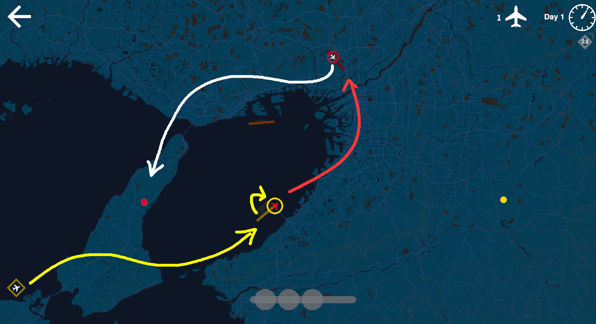
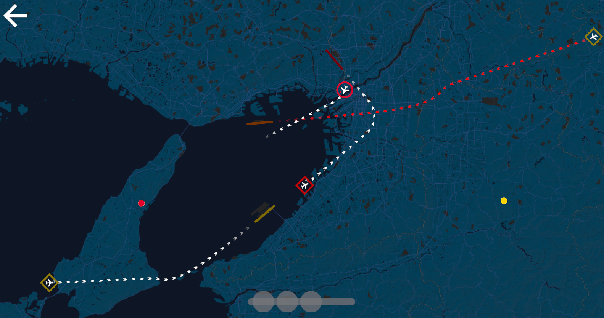

# Mini Center Control

A Mini Airways mod for center ATC. Departure aircraft, depending on the aircraft color need to either be directed to a destination waypoint (white plane icon), or another runway (colored plane icon). Departure aircraft can only take off from a specific runway, specified by its border color. Arrival aircraft can only land on a specific runway, also specified by its border color. 25% of arrival aircraft is just passing through your airspace and need to be directed to a destination waypoint.

# How to Install

- Switch the game to `mod_feat` [branch](https://partner.steamgames.com/doc/store/application/branches?) on Steam.
- Backup and remove all `.dll` in `<path_to_game>\Mini Airways\BepInEx\plugins`.
- Copy [MiniCenterControl.dll](https://github.com/ericpzh/MiniCenterControl/blob/main/bin/Debug/netstandard2.1/MiniCenterControl.dll) into `<path_to_game>\Mini Airways\BepInEx\plugins`
- Example [map](https://github.com/ericpzh/MiniCenterControl/blob/main/Osaka.cm1).

***

# 迷你区调

一个模拟区调的迷你空管Mod。若离场飞机图标为白色，则其需要被引导至其边框相应颜色的目标点。若离场飞机图标为其他颜色，则其需要被引导至相应颜色的另一条跑道。离场飞机只能从与其边框相对应颜色的跑道起飞。进场飞机只能降落在与其边框相对应颜色的跑道。25%的进场飞机需要穿越空域并被引导至相应颜色的目标点。

# 如何安装

- 右键库中的Mini Airways，[属性 - 测试版 - mod_feat](https://partner.steamgames.com/doc/store/application/branches?l=schinese), 更新。
- 备份然后删除所有 `<path_to_game>\Mini Airways\BepInEx\plugins`里的`.dll`文件。
- 复制[MiniCenterControl.dll](https://github.com/ericpzh/MiniCenterControl/blob/main/bin/Debug/netstandard2.1/MiniCenterControl.dll) 到 `<path_to_game>\Mini Airways\BepInEx\plugins`。
- 示例[地图](https://github.com/ericpzh/MiniCenterControl/blob/main/Osaka.cm1).
